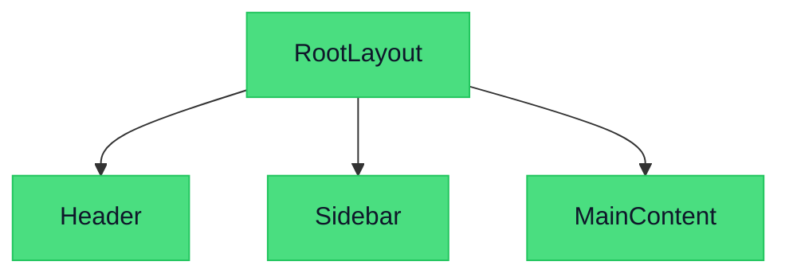
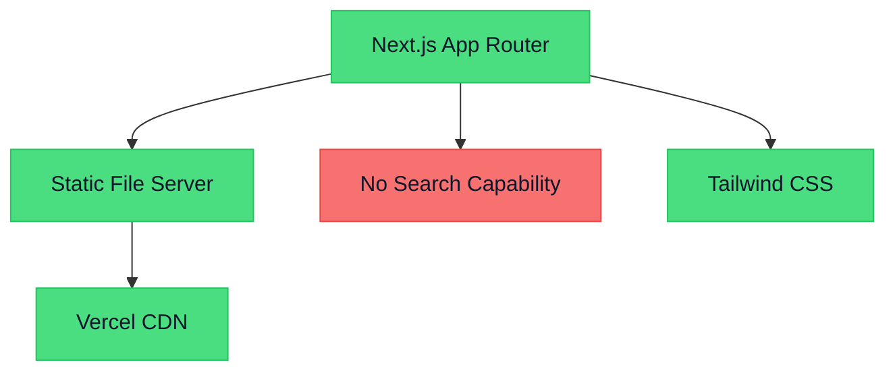
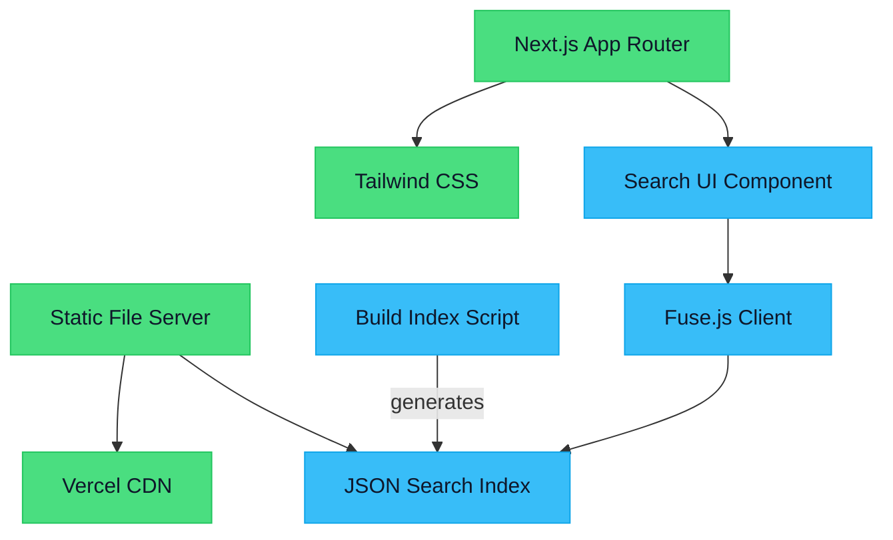
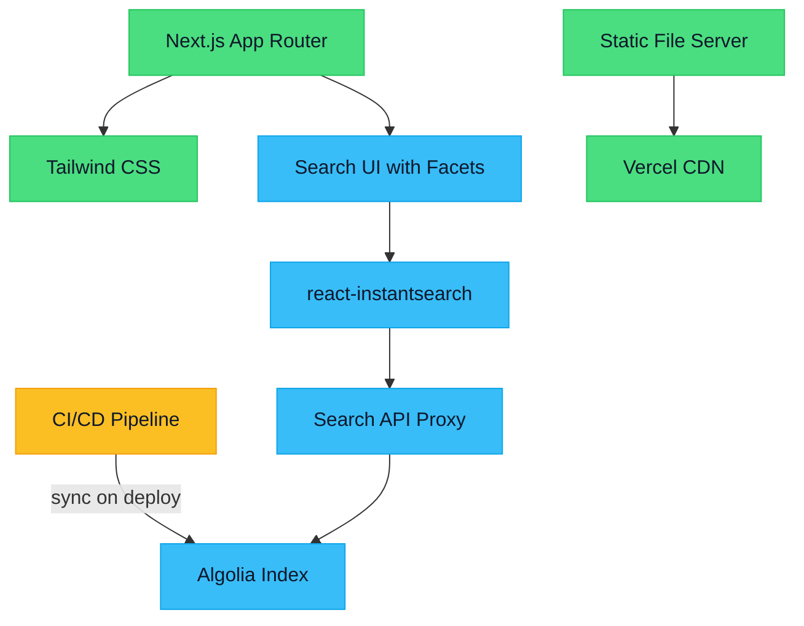
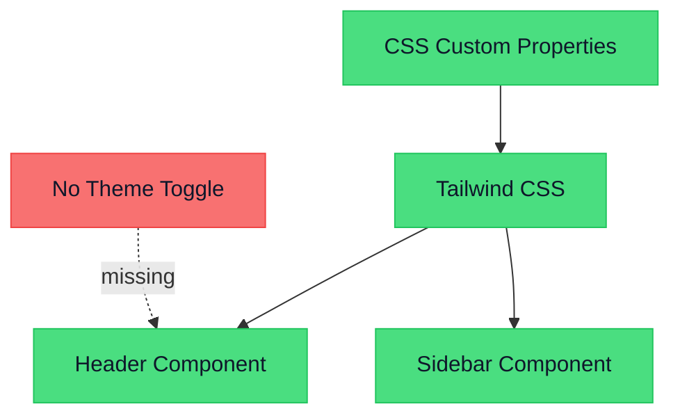
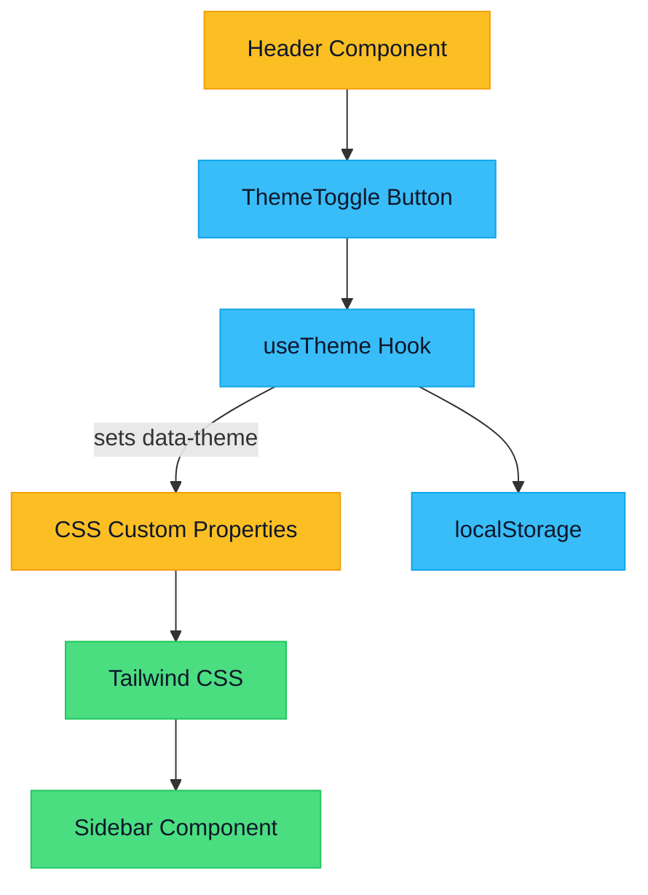

# Site Evolution Report: Example App

*Generated: 2026-01-01T12:00:00*

## Executive Summary

Example App has a solid technical foundation but lags competitors on two high-visibility features: site search and dark mode.

**Top priorities:**
- **Add Site Search** (3-5 days, Fuse.js) — both competitors offer it; high user value signal
- **Add Dark Mode** (1-2 days) — quick win enabled by existing CSS variable infrastructure
- **Fix Mobile Navigation** (1-2 days) — sidebar overlaps content at 768px; 60% of traffic is mobile

All three recommendations are low-risk and can be delivered without architectural changes. Start with Dark Mode and Mobile Nav in parallel, then ship Search.

## Analysis Configuration

- **Target path:** N/A
- **Target URL:** https://example.com
- **Priorities:**
  - Better UX and new features
  - Performance and accessibility

## Comparative Research

Two competitors analyzed. Site search is a significant gap — both competitors offer it. Dark mode is offered by one. Mobile navigation needs improvement.

### Competitors Analyzed

#### Acme Search (https://acme.example.com)
*Same market segment*

**Strengths:**
- Fast site search
- Dark mode
- Mobile-first design
**Weaknesses:**
- Limited content depth

#### BetterDocs (https://betterdocs.example.com)
*Similar content structure*

**Strengths:**
- Excellent navigation
- Full-text search
**Weaknesses:**
- Slow initial load

### Feature Matrix

| Feature | Current Site | Acme Search | BetterDocs |
|---------|-------------|---|---|
| Site Search | no | yes | yes |
| Dark Mode | no | yes | no |
| Mobile Nav | partial | yes | yes |

### Gaps Identified

- 🔴 **No site search** (seen in: Acme Search, BetterDocs)
- 🟡 **No dark mode** (seen in: Acme Search)

### UX Patterns Observed

- **Sticky sidebar nav**: Fixed left navigation that stays in view while scrolling (seen in: Acme Search)
- **Progressive disclosure**: Show details on demand rather than all at once (seen in: Acme Search, BetterDocs)

## Code Analysis

Well-structured Next.js 14 app with App Router. TypeScript throughout. Tailwind for styling with a nascent design token system. High extensibility score — adding new features like search or dark mode should be straightforward.

### Tech Stack

| Technology | Category | Version | UX Pros | UX Cons |
|-----------|----------|---------|---------|---------|
| Next.js | framework | 14 | Fast page loads, SSR/SSG support | Large bundle without optimization |
| Tailwind CSS | styling | 3 | Consistent spacing, Responsive utilities | — |
| React | ui-library | 18 | Component reuse, Rich ecosystem | — |

### Architecture Diagram

### Tech Debt

- 🟡 **Global CSS overrides conflict with Tailwind utilities in 3 components** (src/styles/globals.css)
  - Suggestion: Migrate to Tailwind-only styling
- 🟢 **Large synchronous imports in Header increase TTI** (src/components/Header.tsx)
  - Suggestion: Use dynamic imports for non-critical icons

## Recommendations

Three recommendations. Site Search is the highest-impact item. Dark Mode and Mobile Nav are quick wins that can ship in parallel.

### Ranked Recommendations

#### #1: Add Site Search (`REC-001`)

**Category:** medium-term | **Complexity:** low

Implement full-text search so users can find content quickly. Currently a major gap vs. both competitors.

*Rationale: Both competitors offer search. High user value signal from analytics showing users hitting dead ends.*

**Scores:** User Value: 9/10 | Novelty: 4/10 | Feasibility: 8/10

#### #2: Add Dark Mode (`REC-002`)

**Category:** quick-win | **Complexity:** low

Provide a light/dark theme toggle. Acme Search already offers this; user demand is increasing.

*Rationale: CSS variable system already in place — low implementation cost for high perceived value.*

**Scores:** User Value: 7/10 | Novelty: 3/10 | Feasibility: 9/10

#### #3: Improve Mobile Navigation (`REC-003`)

**Category:** quick-win | **Complexity:** low

Redesign the sidebar navigation for mobile with a slide-in drawer pattern.

*Rationale: 60% of traffic is mobile. Current sidebar collapses poorly on small screens.*

**Scores:** User Value: 8/10 | Novelty: 2/10 | Feasibility: 9/10

### Quick Wins

- **Add Dark Mode** (`REC-002`) — Improved user comfort for evening readers; brand modernization
- **Improve Mobile Navigation** (`REC-003`) — Better mobile engagement and reduced frustration

## Feasibility Assessment

All three recommendations are low-risk. Dark Mode and Mobile Nav are especially easy given existing infrastructure. Site Search is moderate effort but carries no migration risk.

| Rec ID | Rating | Cost | Dev Days | Risk |
|--------|--------|------|----------|------|
| REC-001 | moderate | medium | 3-5 days | low |
| REC-002 | easy | small | 1-2 days | low |
| REC-003 | easy | small | 1-2 days | low |

## Quality Audit

Two serious accessibility issues (focus indicators, contrast). LCP and INP need improvement. Quick wins: preload hero image, add focus-visible styles.

### Accessibility Issues

- **[serious]** Search input placeholder text has insufficient contrast (3.2:1 vs 4.5:1 required) (WCAG 1.4.3)
  - Fix: Darken placeholder text to #767676 or add visible label
- **[serious]** Sidebar links lack visible focus indicators (WCAG 2.4.7)
  - Fix: Add focus-visible outline to all interactive elements

### Performance Metrics

| Metric | Value | Rating |
|--------|-------|--------|
| LCP | 2.4s | needs-improvement |
| FCP | 1.1s | good |
| CLS | 0.05 | good |
| INP | 180ms | needs-improvement |

### Priority Issues

- **[high]** LCP above 2.5s threshold due to unpreloaded hero image (performance)
- **[high]** Missing focus indicators on sidebar navigation (accessibility)
- **[medium]** Heavy Sidebar click handler causing INP issues (performance)

## UX & Design

Strong desktop experience with clear hierarchy and good whitespace. Two major issues: mobile navigation overlap and missing dark mode. Both are addressable in under a week.

**Overall Impression:** A well-executed, professional design that prioritizes content readability. The primary opportunities are mobile navigation and dark mode — both are quick wins given the existing infrastructure.

### Strengths

- Clean, professional aesthetic with consistent brand color application
- Generous whitespace makes content easy to scan
- Strong H1-H3 typographic hierarchy
- Consistent use of CSS custom properties enables easy theming

### Layout & Visual Hierarchy

- **Visual Hierarchy:** Strong — primary content is clearly distinguished from navigation
- **Whitespace:** Generous whitespace around content blocks improves readability
- **Grid:** 12-column grid applied consistently; minor inconsistencies in article card padding
- **Responsive:** Desktop layout is polished; mobile sidebar collapses awkwardly and requires attention

### Typography

- **Readability:** Body text at 16px with 1.6 line-height is comfortable for long-form reading
- **Hierarchy:** H1-H3 scale is clear; H4 and below are under-differentiated
- **Consistency:** Minor inconsistency in article card titles (some use semibold, some regular)

### Color

- **Palette:** Neutral palette with a single brand accent — cohesive and professional
- **Contrast:** Most text meets WCAG AA. Placeholder text and muted labels need darkening.
- **Brand:** Brand color applied consistently to CTAs and active states
- **Dark Mode:** No dark mode — significant gap vs. competitor Acme Search

### Navigation

- **Clarity:** Top nav is clear; sidebar labels are descriptive
- **Information Architecture:** Logical section grouping; max 2 levels deep
- **Mobile:** Sidebar overlaps content at 768px breakpoint; needs a drawer pattern

### Design Issues

- 🟡 **[navigation]** Sidebar collapses poorly on mobile — overlaps content at 768px
  - Recommendation: Implement slide-in drawer with overlay for mobile breakpoints
  - Competitors doing better: Acme Search, BetterDocs
- 🟡 **[color]** No dark mode option increases eye strain for evening readers
  - Recommendation: Add CSS-variable-based dark theme with localStorage persistence
  - Competitors doing better: Acme Search
- 🟢 **[typography]** H4 and H5 headings are visually identical — hierarchy breaks down in deeply nested content
  - Recommendation: Add 1-2px font-size difference and letter-spacing variation to lower heading levels

## Tech Stack Recommendations

Two features evaluated. Site Search requires 3-5 days with Fuse.js (simple) or 1-2 weeks with Algolia (comprehensive). Dark Mode is a 1-2 day quick win — the existing CSS variable system makes it trivial.

### Site Search

**Competitor parity:** Acme Search, BetterDocs already offer this feature.

Next.js static site with App Router — client-side search fits natively with no server changes. Algolia would require a new API route.

#### Current Architecture — Search Gap

The current site is a well-structured static Next.js app on Vercel (green). The only gap for search is the complete absence of any search capability (red) — no index, no UI, no way for users to find content by keyword. Everything else is healthy and reusable.

- **Keep (green):** Next.js App Router, Static File Server, Tailwind CSS, Vercel CDN
- **Issues (red):** No Search Capability

#### Simple Approach — Fuse.js Client Search

The blue items show what gets built: a JSON search index generated at build time, Fuse.js to query it in-browser, and a Search UI component wired into the header. All green items stay exactly as-is — no server changes, no new infrastructure, no migration. Ships in 2-3 days.

- **Keep (green):** Next.js App Router, Static File Server, Tailwind CSS, Vercel CDN
- **New (blue):** Build Index Script, JSON Search Index, Fuse.js Client, Search UI Component

#### Comprehensive Approach — Algolia Hosted Search

Blue items: a hosted Algolia index (syncs on every deploy), the react-instantsearch SDK, a richer search UI with filters, and a lightweight API proxy. Yellow: CI/CD needs one-time update to push content to Algolia. Everything green is untouched. Delivers typo tolerance, analytics, and infinite scale — at $50-500/month and 1-2 weeks of work.

- **Keep (green):** Next.js App Router, Static File Server, Tailwind CSS, Vercel CDN
- **Modify (yellow):** CI/CD Pipeline
- **New (blue):** Algolia Index, react-instantsearch, Search UI with Facets, /api/search Proxy

#### Simple Approach: Client-side full-text search using Fuse.js over a pre-built JSON index generated at build time

| | |
|---|---|
| **Stack** | Fuse.js, Next.js build script |
| **New dependencies** | fuse.js |
| **Architecture fit** | fits_as_is |
| **Effort** | 2-3 days |
| **Pros** | No server required, Zero latency after initial load, Easy to maintain |
| **Cons** | Limited to indexed content only, No analytics on queries, Poor for large corpora |

#### Comprehensive Approach: Algolia-hosted search with typo tolerance, facets, and query analytics

| | |
|---|---|
| **Stack** | Algolia, react-instantsearch, Next.js API Route |
| **New dependencies** | algoliasearch, react-instantsearch |
| **Architecture fit** | minor_changes |
| **Effort** | 1-2 weeks |
| **Architecture changes** | Add Algolia index sync step to CI/CD pipeline, Add /api/search proxy route for server-side query proxying |
| **Pros** | Sub-10ms search, Typo tolerance, Full analytics dashboard, Scales to millions of pages |
| **Cons** | $50-500/month recurring cost, Vendor lock-in, CI/CD changes required |

**Recommendation:** simple — Current site has under 500 pages. Fuse.js delivers adequate search quality at zero cost with no architectural changes. Revisit Algolia if content grows past 1,000 pages or query analytics become important.

### Dark Mode

**Competitor parity:** Acme Search already offer this feature.

CSS variable system already in place — dark mode is a natural extension of the existing theming infrastructure.

#### Current Architecture — No Theming

The site already uses CSS custom properties (variables) for colors — that foundation is solid (green). What's missing is a theme toggle and dark variable definitions. No existing component handles this (red). The good news: no architectural changes are needed, just additions.

- **Keep (green):** CSS Custom Properties, Tailwind CSS, Header Component, Sidebar Component
- **Issues (red):** No Theme Toggle

#### Simple Approach — CSS Variable Dark Mode

Three new items (blue): a useTheme hook that reads/writes localStorage, a ThemeToggle button placed in the Header, and the dark CSS variable values added to the stylesheet. Two existing items need small updates (yellow): CSS variables get dark-mode values, Header gets the toggle button. Everything else is untouched. Ships in 1-2 days.

- **Keep (green):** Tailwind CSS, Sidebar Component
- **Modify (yellow):** CSS Custom Properties, Header Component
- **New (blue):** useTheme Hook, ThemeToggle Button, localStorage

#### Simple Approach: CSS variable swap using a data-theme attribute toggled by a localStorage-backed React hook

| | |
|---|---|
| **Stack** | CSS Custom Properties, React useState/useEffect, localStorage |
| **New dependencies** | None |
| **Architecture fit** | fits_as_is |
| **Effort** | 1-2 days |
| **Pros** | Zero new dependencies, Instant theme switch with no flash, Persists across sessions |
| **Cons** | Manual audit of all components needed for edge cases |

**Recommendation:** simple — The existing CSS variable infrastructure makes a native CSS approach the obvious choice. No library needed. The only work is defining dark values and adding a toggle.

---

*Report generated by [Site Evolution Agents](https://github.com/site-evolution-agents)*